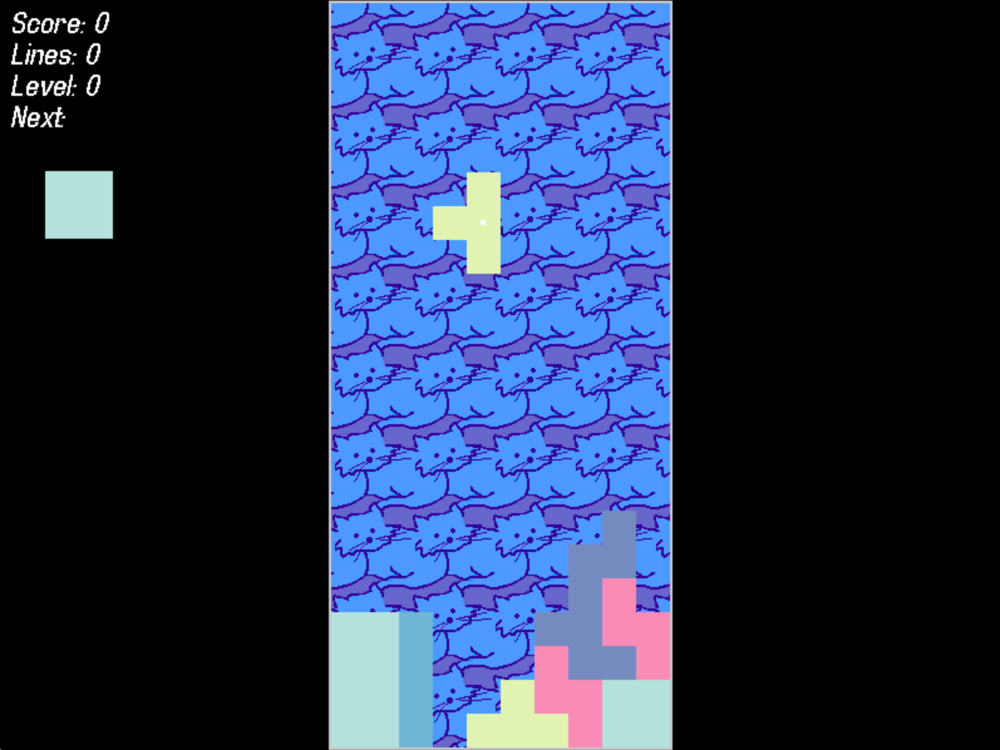

# tet.rs
A tetris clone in Rust, just for fun.

## Version History
 * 2024/07/25: Removed SDL_gfx and made my own version of FPSManager

## To Build (Mac)
 1. Install SDL2_image, SDL2_ttf, SDL frameworks from Homebrew
 3. `LIBRARY_PATH="$(brew --prefix)/lib" cargo build`
